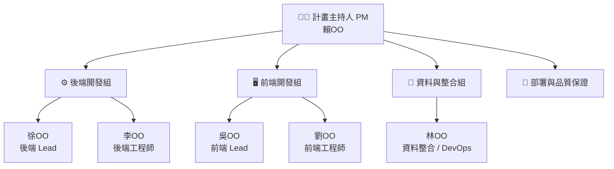
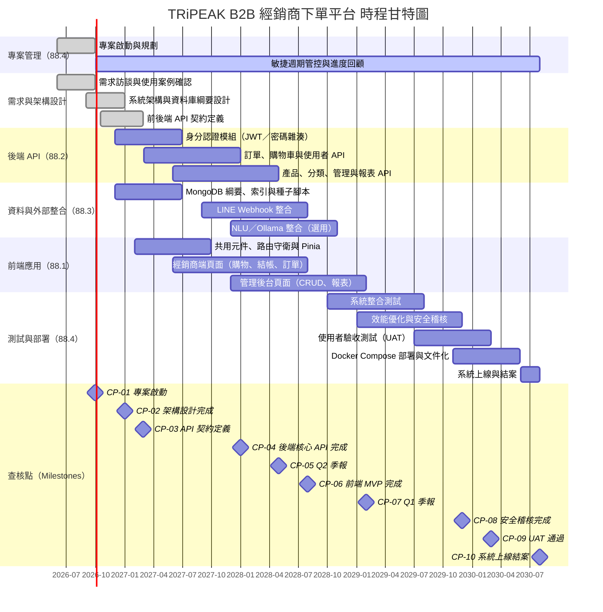

# TRiPEAK B2B 經銷商下單平台

TRiPEAK B2B 經銷商下單平台是一個專為自行車零組件經銷商設計的訂購系統，用於管理產品目錄、訂單和銷售分析。

## 功能特點

### 經銷商功能

- 瀏覽和搜索產品目錄
- 購物車和訂單管理
- 訂單狀態追蹤
- 個人帳戶管理
- 歷史訂單查詢

### 管理員功能

- 用戶管理 (新增、編輯、停用經銷商帳戶)
- 產品管理 (新增、編輯、上下架產品)
- 訂單管理 (處理訂單、更新訂單狀態)
- 分類管理
- 銷售報表和數據分析
- LINE 通知管理

## 技術架構

### 前端

- Vue 3 (Composition API)
- Vuetify 3
- Vue Router
- Pinia 狀態管理
- Axios
- Chart.js

### 後端

- Node.js + Express
- MongoDB + Mongoose
- JWT 認證
- RESTful API
- LINE Bot SDK

## 專案結構

```
tripeak-b2b/
├── backend/              # 後端 API 服務
│   ├── src/              # 源碼
│   ├── public/           # 靜態資源
│   └── ...
├── frontend/             # 前端 Vue 應用
│   ├── src/              # 源碼
│   ├── public/           # 靜態資源
│   └── ...
├── .gitignore            # Git 忽略配置
└── README.md             # 專案說明文檔
```

---

## 4. 專案組織

### 4.1 對外溝通管道

#### 溝通方式總覽

| 管道 | 工具／平台 | 使用情境 | 頻率 |
| --- | --- | --- | --- |
| **電子郵件（Email）** | 學校信箱 / Gmail | 正式文件往來、會議通知、外部單位聯繫、交付物送審 | 依需求 |
| **即時通訊（LINE）** | LINE 群組「TRiPEAK-88」 | 日常進度回報、快速問題討論、檔案傳遞、緊急通知 | 每日 |
| **手機通話** | 個人手機 | 緊急事項、無法即時回覆 LINE 時的備援聯繫 | 緊急時 |
| **正式會議** | Google Meet / 實體教室 | Sprint 計畫、Sprint 回顧、階段驗收、與指導教授討論 | 每週一次 |

#### 對外溝通負責人員

| 角色 | 姓名 | 負責對外事項 |
| --- | --- | --- | --- |
| **計畫主持人（PM）** | 賴OO | 統一對外窗口：指導教授溝通、課程繳交、外部協作聯繫 |
| **技術副窗口** | 徐OO | 技術規格確認、與外部 API 廠商（LINE）技術對接 |

> 其他成員如需對外聯繫，須事先告知 PM，以確保溝通口徑一致。

---

### 4.2 內部架構

#### 組織架構圖



> 本專案採敏捷開發（簡化版 Scrum），各組在每個 Sprint 內跨職能協作，組別劃分為主要責任歸屬，非嚴格獨立分工。

---

### 4.3 角色與職責

| 編號 | 姓名 | 角色 | 主要職責 |
| --- | --- | --- | --- | --- |
| 1 | **李OO** | 後端工程師 | 身分認證模組（JWT、bcrypt）；訂單 API 開發；Mongoose 資料模型；API 測試（Postman Collection） |
| 2 | **徐OO** | 後端 Lead | 身分認證模組（JWT、bcrypt）；API 架構設計；Code Review；與前端 API 契約定義；技術決策紀錄（ADR） |
| 3 | **賴OO** | 計畫主持人（PM） | 專案規劃與進度管控；Sprint 規劃與回顧主持；WBS／甘特圖維護；對外溝通統一窗口；交付物整合審查 |
| 4 | **吳OO** | 前端 Lead | Vue 3 / Vuetify 元件規範；路由守衛與 Pinia 架構；前後端整合介面對齊；管理後台頁面 |
| 5 | **劉OO** | 前端工程師 | 經銷商端頁面（產品瀏覽、購物車、結帳、訂單查詢）；Chart.js 報表視覺化；RWD 調整 |
| 6 | **林OO** | 資料整合 / DevOps | MongoDB 綱要設計、索引與種子腳本；LINE Webhook 整合；Docker Compose 環境建置；`.env.example` 與 README 文件化 |

#### RACI 矩陣（核心交付物）

> R = 執行責任　A = 最終負責　C = 諮詢　I = 知會

| 交付物 | 賴OO PM | 徐OO 後端L | 李OO 後端 | 吳OO 前端L | 劉OO 前端 | 林OO DevOps |
| --- | :---: | :---: | :---: | :---: | :---: | :---: |
| WBS／甘特圖 | **A/R** | I | I | I | I | I |
| API 契約文件 | A | **R** | C | C | I | I |
| 身分認證模組 | A | **R** | C | I | I | I |
| 訂單與購物車 API | A | A | **R** | C | I | I |
| 前端共用元件與路由 | A | I | I | **R** | C | I |
| 經銷商端頁面 | A | I | I | A | **R** | I |
| 管理後台頁面 | A | I | I | **R** | C | I |
| MongoDB 綱要與種子 | A | C | C | I | I | **R** |
| LINE Webhook 整合 | A | C | I | I | I | **R** |
| Docker Compose 環境 | A | C | I | I | I | **R** |
| 系統整合測試 | **A** | R | R | R | R | R |
| 專案結案報告 | **A/R** | C | C | C | C | C |

---


### WBS 編碼規則


| 層級          | 說明                  | 編號範例                             |
| ----------- | ------------------- | -------------------------------- |
| 第 1 層       | 專案根節點（本專案編號 **88**） | `88`                             |
| 第 2 層       | 子系統／主要交付領域          | `88.1` … `88.4`                  |
| 第 n 層 (n≥3) | 接續上層編號後加序號          | `88.2.1`、`88.2.1.1`、`88.2.1.1.1` |


**規則摘要**：第 n 層編號以 **第 (n−1) 層完整編號** 為字首，再附加本層序號（如 `88.2` 之子項為 `88.2.1`、`88.2.2`…）。

### WBS 樹狀示意（編號與子系統對應）

```
88  TRiPEAK B2B 經銷商下單平台專案
├── 88.1  前端應用子系統（Vue 3 / Vuetify）
├── 88.2  後端 API 子系統（Express / MongoDB）
├── 88.3  資料與外部整合子系統
└── 88.4  專案管理、部署與品質保證
```

### WBS 明細表（含 DOD）

#### 88.1 前端應用子系統


| 編號     | 工作包名稱                                   | DOD（完成定義）                               |
| ------ | --------------------------------------- | --------------------------------------- |
| 88.1.1 | 經銷商端：產品瀏覽／搜尋、購物車、結帳與訂單查詢頁面              | 主要使用者流程可於本機完成；路由與 API 錯誤有基本提示；畫面與現有版型一致 |
| 88.1.2 | 管理後台：使用者、產品、訂單、分類、報表、LINE 相關頁面          | 管理員角色可完成 CRUD／狀態更新；圖表頁可載入後端資料           |
| 88.1.3 | 共用基礎：元件、路由守衛、Pinia／Redux 與 Axios API 封裝 | 登入狀態可持久化；未授權導向登入；API 基底 URL 可由環境設定      |


#### 88.2 後端 API 子系統（含第五層深度範例分支）


| 編號         | 工作包名稱                       | DOD（完成定義）                                 |
| ---------- | --------------------------- | ----------------------------------------- |
| 88.2.1     | 身分認證與授權模組                   | 模組責任範圍界定完成，且下層工作項（88.2.1.1）可驗收            |
| 88.2.1.1   | JWT 簽發、驗證與 `auth` 中介層       | 受保護路由拒絕無效 Token；有效 Token 可通過並附帶使用者識別      |
| 88.2.1.1.1 | 登入／註冊／重設密碼 API 與密碼雜湊儲存      | 單元／整合測試或手動測試清單通過；錯誤碼與訊息一致；無明文密碼入庫         |
| 88.2.2     | 訂單、購物車與使用者資料之 REST API 與控制器 | 與 Mongoose 模型一致之 CRUD；關鍵欄位驗證；與前端契約（DTO）對齊 |
| 88.2.3     | 產品、分類、管理端查詢與報表相關 API        | 分頁／篩選可用；管理與經銷商權限區隔符合設計                    |


#### 88.3 資料與外部整合子系統


| 編號     | 工作包名稱                    | DOD（完成定義）                  |
| ------ | ------------------------ | -------------------------- |
| 88.3.1 | MongoDB 綱要、索引與種子／遷移腳本    | 主要集合可啟動即建立；範例資料可重現展示情境     |
| 88.3.2 | LINE Webhook、訊息模型與通知服務串接 | 測試環境可收發／記錄事件；設定值由環境變數管理    |
| 88.3.3 | （選用）NLU／Ollama 相關服務與後端整合 | 健康檢查或 mock 可切換；失敗不影響核心下單流程 |


#### 88.4 專案管理、部署與品質保證


| 編號     | 工作包名稱                                      | DOD（完成定義）                         |
| ------ | ------------------------------------------ | --------------------------------- |
| 88.4.1 | Docker／docker-compose 與 `.env.example` 文件化 | `compose up` 可啟動前後端與資料庫；埠號與依賴說明齊備 |
| 88.4.2 | README／報告與版本提交紀律                           | 新成員可依文件建置；本次作業交付物（含 WBS）已納入版本庫或附件 |
| 88.4.3 | 整合測試與驗收清單（核心流程）                            | 註冊登入、下單、後台變更狀態等主流程可重複驗證           |


### 深度說明

### **最深路徑**：`88` → `88.2` → `88.2.1` → `88.2.1.1` → `88.2.1.1.1`（共 **五層** 編碼深度，對應身分認證由模組→JWT 中介層→登入註冊與密碼安全之細部交付）。

- **其餘分支**：`88.1`、`88.3`、`88.4` 之各工作包均至少展開至 **第三層**（`88.x.y`），並於上表定義 DOD，利於驗收與時程估計。

### 5.2.1 補充：WBS 第 2 層人力時間與成本預估

**估算目標**：對 `88.1`～`88.4`（WBS 第 2 層）進行  

1. **人力時間** 預估、2) **成本金額** 預估。  
估算流程採「先估人數與工期，再換算人力時間與成本」。

#### 估算假設

- 幣值：**新台幣（NTD）**
- 團隊組成：**共 6 人（1 位 PM + 5 位工程師）**
- 估算口徑：各 WBS 第 2 層節點均以**同一組 6 人團隊**投入估算
- 成本口徑：依你提供之 114 年外薪資水準，採**角色別月成本**估算
  - PM（計畫主持人）月成本：`125,620 + 46,241 = 171,861` 元
  - 工程師（軟體開發及程式設計師）月成本：`57,685 + 16,830 = 74,515` 元
- 團隊月成本：`1 × 171,861 + 5 × 74,515 = 544,436` 元
- 團隊年成本：`544,436 × 12 = 6,533,232` 元
- 人力時間換算：`人年 = 人數 × 年數`（或 `人年 = 人月 ÷ 12`）
- 專案規模門檻：**需大於 20 人年**

#### 估算公式

- **人力時間**：`E = P × T`
  - `E`：人力時間（人年）
  - `P`：投入人數（人）
  - `T`：工作時間（年）
- **成本金額**：`C = M × (Npm × Spm + Ndev × Sdev)`
  - `C`：成本（NTD）
  - `M`：工作月數（年數 × 12）
  - `Npm`、`Ndev`：PM 與工程師人數（本專案為 `1`、`5`）
  - `Spm`、`Sdev`：PM 與工程師月成本（`171,861`、`74,515`）

#### WBS 第 2 層預估明細（88.1～88.4）


| WBS 編號 | 節點名稱 | 預估人力 (a) | 預估工期 (b) | 人力時間 (人年) | 成本估算（NTD） |
| --- | --- | ---: | ---: | ---: | ---: |
| 88.1 | 前端應用子系統 | 1 PM + 5 工程師（共 6 人） | 1.2 年 | 7.2 | 7,839,878 |
| 88.2 | 後端 API 子系統 | 1 PM + 5 工程師（共 6 人） | 1.5 年 | 9.0 | 9,799,848 |
| 88.3 | 資料與外部整合子系統 | 1 PM + 5 工程師（共 6 人） | 0.8 年 | 4.8 | 5,226,586 |
| 88.4 | 專案管理、部署與品質保證 | 1 PM + 5 工程師（共 6 人） | 0.7 年 | 4.2 | 4,573,262 |
| 88 | 專案合計 | - | - | **25.2 人年** | **27,439,574 NTD** |


#### 規模檢核

- 本專案總人力時間：**25.2 人年**
- 與門檻比較：`25.2 > 20`，**符合「規模大於 20 人年」要求**

#### 範例換算說明

- 若某工作需 2 人、3 個月，則 `2 × 3 = 6 人月 = 0.5 人年`
- 若某工作由 `1 PM + 5 工程師` 執行 3 個月，則成本為 `3 × 544,436 = 1,633,308 NTD`

---

## 5.2.2 時程規劃

### 甘特圖（Gantt Chart）

> 專案啟動日：**2026-06-01**；預計完成日：**2030-08-01**（共約 **4.2 年**，約 50 個月）。  
> 各工作條以 WBS 編號分組，查核點（`◆`）對應 5.2.2.1 之編號。



---

### 5.2.2.1 預定查核點說明

#### 查核點設定原則

查核點依下列兩種維度交叉設定：

| 維度 | 說明 | 範例 |
| --- | --- | --- |
| **時間型** | 依固定週期設定，確保進度透明 | 季報（每季末）、月報（每月底）、里程碑節點 |
| **開發流程階段型** | 依軟體生命週期關鍵轉折設定 | 需求分析完成、架構設計、API 定義、整合、UAT、上線 |

本專案共設 **10 個查核點（CP-01 ～ CP-10）**，其中 CP-05、CP-07、CP-08 屬**時間型（季報）**，其餘屬**開發流程階段型**。

---

#### CP-01｜專案啟動查核點（階段型）

| 項目 | 內容 |
| --- | --- |
| **日期** | 2026-09-30 |
| **類型** | 開發流程階段：啟動（Initiation） |

**查核項目**

- [ ] 專案章程（Project Charter）已核准，範疇、目標與交付物定義明確
- [ ] 團隊角色已分配（1 PM + 5 工程師），聯絡窗口確認
- [ ] 開發環境已建置：Node.js、Vue CLI、MongoDB、Docker、Git 倉庫
- [ ] `.env.example` 草稿完成，必要環境變數（DB 連線、JWT Secret、LINE Token）已識別
- [ ] WBS 第 2 層工作包（`88.1`～`88.4`）已確認，初版 Backlog 已建立

---

#### CP-02｜架構設計完成查核點（階段型）

| 項目 | 內容 |
| --- | --- |
| **日期** | 2026-12-31 |
| **類型** | 開發流程階段：設計（Architecture Design） |

**查核項目**

- [ ] 系統架構圖（前端 Vue 3 ↔ Express API ↔ MongoDB）已定稿並版本化
- [ ] MongoDB 集合設計（User、Product、Order、Category、LineMessage 等）已完成 ERD
- [ ] 角色與權限矩陣（Admin / Dealer）確認，對應路由守衛策略
- [ ] Docker Compose 初版架構（`backend`、`frontend`、`mongo`、`ollama` 服務）草稿完成
- [ ] 技術選型決策紀錄（ADR）完成：JWT 演算法、密碼雜湊方案（bcrypt）、Vuetify 版本

---

#### CP-03｜API 契約定義查核點（階段型）

| 項目 | 內容 |
| --- | --- |
| **日期** | 2027-02-28 |
| **類型** | 開發流程階段：設計→實作交界（API Contract） |

**查核項目**

- [ ] 所有 RESTful 端點清單（路徑、HTTP 方法、Request／Response DTO）已以文件或 Postman Collection 定義
- [ ] 身分認證端點（`POST /auth/login`、`POST /auth/register`、`POST /auth/reset-password`）規格凍結
- [ ] 訂單、產品、購物車、分類、報表等主要資源之端點規格凍結
- [ ] 錯誤碼與錯誤訊息格式（統一 JSON 結構）確認
- [ ] 前後端雙方確認契約無歧義，可分頭開發

---

#### CP-04｜後端核心 API 完成查核點（階段型）

| 項目 | 內容 |
| --- | --- |
| **日期** | 2027-12-31 |
| **類型** | 開發流程階段：實作（Backend Core Implementation） |

**查核項目**

- [ ] JWT 簽發、驗證與 `authMiddleware` 完成：受保護路由拒絕無效 Token，有效 Token 附帶使用者識別（WBS 88.2.1.1）
- [ ] 登入／註冊／重設密碼 API 完成，密碼以 bcrypt 雜湊儲存，無明文入庫（WBS 88.2.1.1.1）
- [ ] 訂單、購物車、使用者資料 CRUD API 與 Mongoose 模型對齊（WBS 88.2.2）
- [ ] Postman / Thunder Client 手動測試清單全數通過
- [ ] MongoDB 主要集合在本機 `docker compose up` 後可自動建立，種子資料可注入

---

#### CP-05｜Q2 季報查核點（時間型）

| 項目 | 內容 |
| --- | --- |
| **日期** | 2028-04-30 |
| **類型** | 時間型：第二季季末季報（Q2 2028 Quarterly Review） |

**查核項目**

- [ ] 季報文件產出：各 WBS 工作包實際進度 vs. 計畫進度（燃盡圖或進度百分比）
- [ ] 產品、分類、管理端與報表 API 開發進度確認（WBS 88.3）
- [ ] 前端共用元件、路由守衛與 Pinia 狀態管理實作進度確認（WBS 88.1.3）
- [ ] NLU／Ollama 健康檢查端點可呼叫，失敗不影響核心下單流程已驗證（WBS 88.3.3）
- [ ] 風險清單更新：識別當前阻礙項（Blocker），制定 Q3 2028 因應策略

---

#### CP-06｜前端 MVP 與 LINE 整合完成查核點（階段型）

| 項目 | 內容 |
| --- | --- |
| **日期** | 2028-07-31 |
| **類型** | 開發流程階段：整合（Frontend MVP & External Integration） |

**查核項目**

- [ ] 經銷商端主要使用者流程可於本機完成：登入 → 瀏覽產品 → 加入購物車 → 結帳 → 查詢訂單（WBS 88.1.1）
- [ ] 管理後台可完成 CRUD 與訂單狀態更新；圖表頁可載入後端報表資料（WBS 88.1.2）
- [ ] LINE Webhook 在測試環境可收發並記錄事件；Bot Token 由環境變數管理（WBS 88.3.2）
- [ ] 前後端整合冒煙測試（Smoke Test）通過：無 CORS 錯誤、API 回應格式與前端預期一致
- [ ] 路由守衛驗證：未登入使用者導向登入頁，Admin 路由拒絕 Dealer 角色

---

#### CP-07｜Q1 季報整合查核點（時間型）

| 項目 | 內容 |
| --- | --- |
| **日期** | 2029-01-31 |
| **類型** | 時間型：第一季季報（Q1 2029 Review） |

**查核項目**

- [ ] 年末季報產出：累計實際成本 vs. 預算（依 5.2.1 各工作包追蹤）
- [ ] 系統整合測試（Integration Test）啟動：所有主要 API 路徑於 Docker Compose 環境下通過
- [ ] 管理後台頁面（CRUD、報表）開發完成，版本合併至 `main`（WBS 88.1.2）
- [ ] 已知技術債清單建立，並排入 Q2 2029 Sprint Backlog
- [ ] `docker compose up` 可完整啟動前後端、MongoDB 及 Ollama 服務，埠號無衝突（WBS 88.4.1）

---

#### CP-08｜安全稽核與效能優化完成查核點（時間型 + 階段型）

| 項目 | 內容 |
| --- | --- |
| **日期** | 2029-11-30 |
| **類型** | 時間型：第四季季報（Q4 2029）+ 開發流程階段：安全／效能（Security Audit） |

**查核項目**

- [ ] Q4 季報產出：整合測試覆蓋率、缺陷密度與修復進度
- [ ] OWASP Top 10 自評清單完成：SQL Injection（NoSQL Injection）、XSS、未授權存取等主要風險確認已緩解
- [ ] JWT Secret、LINE Token、DB 連線字串等敏感資訊確認不存在版本庫，全部以環境變數注入
- [ ] API 回應效能基準測試：主要端點（產品列表、訂單查詢）P95 回應時間 < 500ms
- [ ] MongoDB 索引複審：高頻查詢欄位（productId、orderId、userId、createdAt）已建立索引

---

#### CP-09｜使用者驗收測試（UAT）完成查核點（階段型）

| 項目 | 內容 |
| --- | --- |
| **日期** | 2030-02-28 |
| **類型** | 開發流程階段：驗收（User Acceptance Testing） |

**查核項目**

- [ ] UAT 測試腳本（含 WBS 88.4.3 驗收清單）由利害關係人或代理測試者執行完畢
- [ ] 核心流程通過驗收：註冊登入 → 下單 → 管理後台變更訂單狀態 → 收到 LINE 通知
- [ ] 所有 P0（阻塞性）與 P1（高嚴重度）缺陷已修復並複驗通過
- [ ] 使用者介面一致性確認：版型、字型、色彩與 Vuetify 設計規範對齊（WBS 88.1.1 DOD）
- [ ] 上線前確認清單（Go-Live Checklist）草稿完成，待 CP-10 前簽核

---

#### CP-10｜系統上線與專案結案查核點（里程碑型）

| 項目 | 內容 |
| --- | --- |
| **日期** | 2030-08-01 |
| **類型** | 里程碑：系統正式上線（Go-Live & Project Closure） |

**查核項目**

- [ ] 系統正式部署至生產環境，`docker compose up` 或等效部署方式驗證通過
- [ ] `.env.example` 與 README 建置步驟完整，新成員可依文件於 30 分鐘內完成本機建置（WBS 88.4.2 DOD）
- [ ] 最終版本已提交至版本庫，Tag 標記（`v1.0.0`）並附 Release Notes
- [ ] 專案結案報告產出：包含實際 vs. 計畫人力時間、成本差異、風險回顧與後續維運建議
- [ ] 所有 WBS 工作包之 DOD 完成清單已核簽，專案正式關閉

---

#### 查核點總覽表

| 編號 | 日期 | 類型 | 查核點名稱 | 主要 WBS 對應 |
| --- | --- | --- | --- | --- |
| CP-01 | 2026-09-30 | 階段型（啟動） | 專案啟動與環境建置確認 | 88.4 |
| CP-02 | 2026-12-31 | 階段型（設計） | 系統架構與資料庫設計完成 | 88.2、88.3 |
| CP-03 | 2027-02-28 | 階段型（API 契約） | 前後端 API 契約定義凍結 | 88.2、88.1 |
| CP-04 | 2027-12-31 | 階段型（實作） | 後端核心 API 完成 | 88.2.1、88.2.2 |
| CP-05 | 2028-04-30 | **時間型（Q2 季報）** | Q2 2028 進度季報與風險更新 | 全部 |
| CP-06 | 2028-07-31 | 階段型（整合） | 前端 MVP 與 LINE 整合完成 | 88.1、88.3.2 |
| CP-07 | 2029-01-31 | **時間型（Q1 季報）** | Q1 2029 季報與整合測試啟動 | 全部 |
| CP-08 | 2029-11-30 | **時間型（Q4 季報）** + 階段型 | 安全稽核與效能優化完成 | 88.2、88.4 |
| CP-09 | 2030-02-28 | 階段型（UAT） | 使用者驗收測試通過 | 88.4.3 |
| CP-10 | 2030-08-01 | 里程碑（上線） | 系統正式上線與專案結案 | 88.4.1、88.4.2 |

---

## 5.2.3 資源規劃

本節列出專案執行期間所需之各類資源，涵蓋**開發軟體**、**系統/雲端服務**、**硬體設備**及**辦公環境**四大類。

### 軟體資源

#### 開發工具軟體

| 項次 | 軟體／工具 | 用途 | 授權方式 | 套數／帳號數 |
| :--: | --- | --- | --- | :--: |
| 1 | Visual Studio Code | 前後端原始碼編輯 | 免費開源（MIT） | 6 |
| 2 | Node.js（LTS） | 後端 Express 執行環境 | 免費開源（MIT） | 6 |
| 3 | Vue CLI / Vite | 前端鷹架與開發伺服器 | 免費開源（MIT） | 6 |
| 4 | Git | 版本控制 | 免費開源（GPL） | 6 |
| 5 | Docker Desktop | 容器化本機開發環境 | 免費（個人／教育用） | 6 |
| 6 | Postman | API 測試與文件 | 免費（基本版） | 6 |
| 7 | MongoDB Compass | 資料庫視覺化管理 | 免費開源 | 6 |
| 8 | draw.io / Mermaid | 架構圖、流程圖繪製 | 免費開源 | 6 |

#### 系統／雲端服務

| 項次 | 服務 | 用途 | 授權方式 | 帳號數 |
| :--: | --- | --- | --- | :--: |
| 1 | GitHub（Private Repo） | 原始碼托管、CI/CD、Issue 追蹤 | 免費（GitHub Free） | 1 組織帳號 + 6 人 |
| 2 | MongoDB Atlas（M0 Free） | 雲端 MongoDB 資料庫（測試用） | 免費（512 MB） | 1 |
| 3 | LINE Developers | LINE Messaging API / Webhook | 免費（基本用量） | 1 |
| 4 | Ollama（自架） | 本地 LLM 推論服務（選用 NLU） | 免費開源 | 1 台主機 |
| 5 | Google Meet | 線上 Sprint 會議 | 免費（Google 帳號） | 6 |
| 6 | Google Drive | 文件共享、會議紀錄、報告草稿 | 免費（15 GB/帳號） | 6 |

### 硬體資源

| 項次 | 設備 | 規格需求（最低） | 用途 | 數量 |
| :--: | --- | --- | --- | :--: |
| 1 | 開發用筆記型電腦 | CPU：i5/Ryzen 5 以上；RAM：16 GB；SSD：256 GB | 日常開發、本機執行 Docker Compose | 6 台（成員自備） |
| 2 | 部署伺服器 / NAS | CPU：4 核；RAM：8 GB；SSD：128 GB | 正式環境部署（Docker Compose）、Ollama 本地推論 | 1 台（共用） |
| 3 | 網路設備 | 有線 / Wi-Fi 100 Mbps 以上 | 開發、遠端協作 | 依場地 |

### 辦公環境資源

| 項次 | 資源 | 說明 | 使用方式 |
| :--: | --- | --- | --- |
| 1 | 學校電腦教室 | 實體 Sprint 會議、聯合開發衝刺 | 每週一次，視需求預約 |
| 2 | 圖書館討論室 | 小組討論、文件撰寫 | 視需求預約（2～4 人） |
| 3 | 線上協作空間 | Google Meet + Google Drive + GitHub | 非同步作業、每日 LINE 同步 |

### 資源總覽（量化摘要）

| 類別 | 項目數 | 需採購／付費項目 | 說明 |
| --- | :--: | --- | --- |
| 開發工具軟體 | 8 項 × 6 套 = 48 套 | **0 項**（全部免費/開源） | 無需額外採購 |
| 系統／雲端服務 | 6 項 | **0 項**（免費方案） | 正式上線如流量超過免費額度需升級 |
| 硬體設備 | 3 類 | **1 台部署伺服器**（成員自備或學校借用） | 開發筆電成員自備 |
| 辦公環境 | 3 類 | **0 項**（學校設施） | 教室與討論室以學校資源為主 |

---

## 5.2.4 預算規劃

本節依成本類別列出專案各項支出估算，並彙整總預算。幣值：**新台幣（NTD）**；估算基準日：**2026-06-01**；專案期程：**4.2 年（50 個月）**。

### 成本類別說明

| 類別 | 說明 |
| --- | --- |
| **人力成本** | 依 WBS 各工作包人月換算，採 5.2.1 補充之角色月成本 |
| **軟體成本（開發）** | 開源工具，授權費用為零 |
| **軟體成本（外購/訂閱）** | 正式上線後可能需要的雲端服務升級方案 |
| **硬體成本** | 部署伺服器購置或租用 |
| **文件撰寫成本** | 含 WBS、報告、README、API 文件等文件工時折算 |
| **其他成本** | 教育訓練、差旅（會議）、備援與風險準備金 |

### 人力成本明細（依 WBS 第 2 層）

> 月成本基準（來自 5.2.1）：PM `171,861 NTD/月`；工程師 `74,515 NTD/月`  
> 團隊月成本：`1 × 171,861 + 5 × 74,515 = 544,436 NTD`

| WBS 編號 | 節點名稱 | 工期（月） | 人力時間（人年） | 人力成本（NTD） |
| --- | --- | ---: | ---: | ---: |
| 88.1 | 前端應用子系統 | 14.4 個月 | 7.2 | 7,839,878 |
| 88.2 | 後端 API 子系統 | 18.0 個月 | 9.0 | 9,799,848 |
| 88.3 | 資料與外部整合子系統 | 9.6 個月 | 4.8 | 5,226,586 |
| 88.4 | 專案管理、部署與品質保證 | 8.4 個月 | 4.2 | 4,573,262 |
| **88** | **專案人力合計** | **50.4 個月** | **25.2 人年** | **27,439,574** |

### 軟體成本

#### 開發工具軟體（自行開發）

| 項目 | 授權費用（NTD） | 備註 |
| --- | ---: | --- |
| VS Code、Node.js、Vue CLI、Git、Docker Desktop、Postman、MongoDB Compass、Mermaid | 0 | 全數採免費開源方案 |
| **小計** | **0** | |

#### 外購／訂閱軟體（正式上線後）

| 項目 | 單價（NTD/月） | 期數 | 小計（NTD） | 備註 |
| --- | ---: | ---: | ---: | --- |
| MongoDB Atlas M10（正式環境） | 1,650 | 24 個月（上線後 2 年） | 39,600 | 正式上線前使用免費 M0 |
| GitHub Team（組織協作） | 450 | 50 個月 | 22,500 | 含 Private Repo、CI Actions |
| LINE Messaging API（付費用量） | 900 | 24 個月 | 21,600 | 免費 200 則/月；超出按量計費估算 |
| **小計** | | | **83,700** | |

### 硬體成本

| 項目 | 單價（NTD） | 數量 | 小計（NTD） | 備註 |
| --- | ---: | ---: | ---: | --- |
| 部署伺服器（Mini PC / NAS） | 25,000 | 1 | 25,000 | Docker 正式部署、Ollama 推論 |
| 網路設備（交換器/路由器） | 3,000 | 1 | 3,000 | 共用實驗室環境 |
| UPS 不斷電系統 | 4,500 | 1 | 4,500 | 伺服器電源保護 |
| **小計** | | | **32,500** | |

### 文件撰寫成本

> 以工程師月成本（`74,515 NTD`）折算，文件工時估 **2 人月**。

| 項目 | 人月 | 成本（NTD） |
| --- | ---: | ---: |
| WBS、甘特圖、查核點文件 | 0.3 | 22,355 |
| API 文件（Postman Collection／Swagger） | 0.3 | 22,355 |
| README、`.env.example`、部署指南 | 0.2 | 14,903 |
| 系統架構圖、ERD、ADR 決策紀錄 | 0.2 | 14,903 |
| 專案結案報告 | 1.0 | 74,515 |
| **小計** | **2.0** | **149,031** |

### 其他成本

| 項目 | 金額（NTD） | 說明 |
| --- | ---: | --- |
| 教育訓練（線上課程、技術書籍） | 18,000 | 每人約 3,000 元 × 6 人 |
| 差旅與會議（交通、場地） | 12,000 | 實體 Sprint 會議、期末展示 |
| 風險準備金（10% of 硬體 + 軟體訂閱） | 11,620 | `(32,500 + 83,700) × 10%` |
| **小計** | **41,620** | |

### 預算總表

| 成本類別 | 金額（NTD） | 佔比 |
| --- | ---: | ---: |
| 人力成本（WBS 各工作包） | 27,439,574 | 99.0 % |
| 軟體成本－開發工具 | 0 | 0.0 % |
| 軟體成本－外購訂閱 | 83,700 | 0.3 % |
| 硬體成本 | 32,500 | 0.1 % |
| 文件撰寫成本 | 149,031 | 0.5 % |
| 其他成本 | 41,620 | 0.1 % |
| **專案總預算** | **27,746,425** | **100 %** |

> **說明**：人力成本佔總預算 99%，符合軟體專案人力密集的特性。非人力成本（軟硬體、文件、其他）合計約 **306,851 NTD**，主要為正式上線後雲端服務訂閱與一次性硬體採購。

---

## 6. 流程模式

**作業對應**：第三章（流程／生命週期相關）— 說明本專案在軟體生命週期中如何安排需求、設計、實作、測試與交付之節奏，並於 **6.1.1** 具體選定 **開發模式** 與其適用理由。

### 6.1 流程模式

軟體專案的「流程模式」可從兩個層次理解：**生命週期模型**（例如瀑布、螺旋、迭代增量）決定整體階段劃分與風險控管方式；**開發模式／方法**（例如敏捷、RUP、看板）則決定團隊如何排程、溝通與交付可執行軟體。TRiPEAK B2B 平台同時具備 **雙端應用（Vue 前端 + Express 後端）**、**MongoDB 資料模型**、**JWT 安全機制** 與 **LINE／選用 NLU 等外部整合**，需求易隨營運或法規微調，故不適合將全部規格凍結後才一次性實作的純瀑布流程；本專案採 **以迭代增量為骨架、以敏捷實務為節奏** 的流程取向，並於下一小節固定開發模式名稱與內涵。

### 6.1.1 開發模式

#### 選定模式

**敏捷開發（Agile Development）**，並以 **簡化版 Scrum**（固定長度之迭代／Sprint、每迭代產出可示範之增量）作為主要運作方式；必要時對單一課題（例如 LINE Webhook 除錯）輔以 **看板（Kanban）式** 的可視化待辦，但不改變「短週期交付可驗收軟體」之核心。

#### 挑選理由（與本專案屬性對齊）

| 專案屬性                               | 為何適合敏捷／迭代                                     |
| ---------------------------------- | --------------------------------------------- |
| 功能面多（經銷商購物流、管理後台、報表、通知、B2B腳踏車零件配單） | 可優先交付 **最小可行產品（MVP）** 再依回饋擴充，降低一次規劃過大而落後市場的風險 |
| 前後端分離、介面契約（REST）需反覆對齊              | 短迭代內完成「可整合」之垂直切片，利於及早發現 API 與畫面不一致            |
| 外部依賴（LINE、選用 Ollama）               | 環境與第三方行為變動多，**頻繁整合與驗證** 比長期設計文件更能控制風險         |
| 與 WBS／DOD 搭配                       | 每個工作包可在 Sprint 內對應 **可驗收條件**，與敏捷「完成定義」一致      |


相對地，**純瀑布模型** 假設前期需求可高度凍結且變更成本高；對本專案這類 Web 系統與外部整合並存之情境，若堅持長階段才整合，易在後期才暴露介面與部署問題，修正成本較高。故選擇強調 **早期交付、持續整合** 的敏捷迭代思維。

#### 模式特性

1. **迭代（Iteration）**：以 1～3 週等固定長度為一個 Sprint，重複「規劃 → 開發 → 測試 → 檢視」循環。
2. **增量（Incremental）**：每一迭代結束應增加「使用者可感知」之功能或修正，而非僅產出文件。
3. **跨職能協作**：前端、後端、資料綱要與 DevOps（Docker）可在同一迭代內對齊交付物。
4. **可調整待辦清單（Product Backlog）**：優先級可依營運或作業截止日調整，符合在職專班與業務並行之現實。
5. **自省（Retrospective）**：每迭代簡短回顧流程與工具（例如測試、文件、分支策略），持續改善。

#### 優點

- **風險前移**：整合與部署問題及早浮現，避免期末才「大爆炸式」接線。  
- **價值較早可見**：利害關係人可在每個 Sprint 末看到可操作版本，利於確認方向。  
- **變更成本較可控**：以 Backlog 重排因應需求微調，勝過大規格書鎖死後再變更。  
- **與現代工具鏈契合**：Git 分支、CI、Docker Compose、環境變數管理等皆適合短週期釋出。  
- **品質意識內建**：若將 **DOD** 與 **測試／Code Review** 納入迭代完成條件，可避免「只求功能列表勾選」而忽略安全與可維運性。

#### 實務上需注意之處（簡要）

敏捷並非「沒有文件」，而是 **剛好夠用、靠近程式碼與可執行成果** 的文件（例如 API 範例、`.env.example`、README 建置步驟）。在學期或專題時程下，仍應保留 **架構決策摘要** 與 **驗收清單**，以滿足課程與日後維運之可追溯性。

---

## 7. 專案品質管理

---

### 7.1 品質規劃

品質規劃旨在**事前定義**品質標準、測試方法與查核機制，使全體成員對「何謂完成、何謂合格」有共同認知。

#### 品質標準

| 面向 | 標準 | 驗證方式 |
| --- | --- | --- |
| **功能正確性** | 所有 API 端點回應符合契約 DTO；前端主要使用者流程可完整執行 | Postman 測試集；手動 Smoke Test |
| **效能** | 主要 API（產品列表、訂單查詢）P95 回應時間 < 500ms | Postman Monitor；Artillery 壓測 |
| **安全性** | 通過 OWASP Top 10 自評；無明文密碼入庫；敏感資訊不入版本庫 | CP-08 安全稽核清單；GitHub Secret Scan |
| **可維護性** | 每個模組至少有 README 說明；API 文件與程式碼同步；函式長度 ≤ 50 行 | Code Review Checklist；ESLint 規則 |
| **可用性** | 系統可用率目標 ≥ 99%（正式上線後）；`docker compose up` 一鍵啟動 | Docker Compose 健康檢查；監控告警 |
| **測試覆蓋率** | 後端核心業務邏輯（身分驗證、訂單計算）單元測試覆蓋率 ≥ 70% | Jest 覆蓋率報告 |

#### 人員教育訓練

| 項次 | 訓練項目 | 對象 | 時間點 | 方式 |
| :--: | --- | --- | --- | --- |
| 1 | Git 分支策略（GitFlow）與 PR Review 流程 | 全員 | CP-01 前（2026-09-30 前） | 內部工作坊（2 小時） |
| 2 | Vue 3 Composition API 與 Pinia 狀態管理 | 前端組（吳OO、劉OO） | Sprint 1～2 | 線上課程 + Pair Programming |
| 3 | Express REST API 設計與 Mongoose ODM | 後端組（徐OO、李OO） | Sprint 1～2 | 線上課程 + Code Review |
| 4 | Docker Compose 本機環境建置 | 全員 | CP-01 前 | 林OO 主講內部示範（1 小時） |
| 5 | JWT 安全機制與 OWASP Top 10 概覽 | 後端組 + PM | CP-03 前（2027-02-28 前） | 自學文件 + 討論會 |
| 6 | Postman API 測試與 Collection 撰寫 | 全員 | CP-03 前 | 徐OO 主講示範（1 小時） |
| 7 | 系統測試與驗收測試執行方法 | 全員 | CP-08 前（2029-11-30 前） | 外部線上課程（每人 3,000 NTD，共 18,000 NTD） |

#### 品質測試方法（四種主要測試）

本專案依軟體測試標準流程，依序執行以下四種測試：

```
單元測試（Unit）→ 整合測試（Integration）→ 系統測試（System）→ 驗收測試（Acceptance）
```

| 測試類型 | 測試對象 | 目的 | 測試者 | 工具／方式 |
| --- | --- | --- | --- | --- |
| **單元測試（Unit Testing）** | 單一函式（Function）或類別（Class） | 驗證最小單元邏輯的正確性，隔離外部依賴 | **模組撰寫者本人** | Jest（後端）、Vitest（前端） |
| **整合測試（Integration Testing）** | 多個模組組合（如 API 路由 + 控制器 + 資料庫） | 確認各模組間互動與合作能完成整體工作功能 | **開發部門（專案小組全員）** | Supertest + Jest；Postman Collection Run |
| **系統測試（System Testing）** | 整個系統（功能、效能、安全性） | 驗證系統在完整環境下符合需求規格與非功能性要求 | **QA 品管（林OO）+ 開發部門** | Artillery 壓測；OWASP ZAP 安全掃描；手動功能測試 |
| **驗收測試（Acceptance Testing）** | 完整系統（從使用者角度） | 由客戶確認系統符合業務需求，作為正式交付依據 | **客戶（經銷商代表）+ 開發技術人員（PM 賴OO + 徐OO）** | UAT 測試腳本；WBS 88.4.3 驗收清單 |

#### 品質查核清單（Quality Checklist）

每個 Sprint 結束及各查核點（CP）前，需逐項確認：

**程式碼品質**
- [ ] 所有 PR 已通過至少 1 人 Code Review 並核准合併
- [ ] ESLint / Prettier 格式檢查無錯誤
- [ ] 新增功能有對應的單元測試，覆蓋率未低於既有水準
- [ ] 無 `console.log` 或 TODO 殘留於主線程式碼

**API 與資料**
- [ ] API 回應格式符合契約 DTO（欄位名稱、型別、狀態碼一致）
- [ ] 必要欄位驗證已實作（Mongoose Schema validation）
- [ ] 敏感欄位（密碼、Token）未出現於 API 回應或 Log

**安全性**
- [ ] `.env` 已列入 `.gitignore`，無敏感資訊進入 Git
- [ ] JWT 有設定過期時間（Access Token ≤ 15 分鐘）
- [ ] 受保護路由已套用 `authMiddleware`

**部署與環境**
- [ ] `docker compose up` 可完整啟動所有服務且健康檢查通過
- [ ] `.env.example` 已更新反映最新環境變數
- [ ] README 建置步驟已驗證（新成員可依步驟重現）

---

### 7.2 品質保證

品質保證（QA）是**過程導向**的活動，目的在於監督開發流程是否符合既定標準，及早發現系統性問題。

#### 監督與問題回報機制

| 機制 | 說明 | 頻率 | 負責人 |
| --- | --- | --- | --- |
| **Sprint Review** | 每 Sprint 結束展示可運行增量，確認功能符合 DOD | 每 Sprint（1～3 週） | PM 賴OO 主持 |
| **Sprint Retrospective** | 回顧流程問題（測試遺漏、文件缺失、溝通不暢），提出改善行動 | 每 Sprint | 全員參與，PM 記錄 |
| **GitHub Issue Tracker** | Bug、待辦事項、改善建議統一以 Issue 追蹤；標記 Priority（P0/P1/P2）與 Label（bug/enhancement/docs） | 持續 | 發現者建立，PM 分派 |
| **每日 LINE 同步** | 以文字簡報當日進度與阻礙（類 Daily Standup）；阻礙項目需在 24 小時內回應 | 每日 | 全員 |
| **查核點進度報告** | CP-05、CP-07、CP-08 三個時間型查核點產出正式進度季報，含實際 vs. 計畫偏差分析 | 每季 | PM 賴OO 撰寫 |

#### 獨立稽核

| 稽核項目 | 執行時間點 | 稽核者 | 稽核方式 |
| --- | --- | --- | --- |
| **程式碼安全稽核** | CP-08（2029-11-30）前 | 林OO（DevOps）+ PM 賴OO | OWASP Top 10 自評表逐項勾選；GitHub Secret Scanning 報告檢視 |
| **API 契約合規稽核** | CP-06（2028-07-31）前 | 徐OO（後端 Lead） | 以 Postman Collection Runner 執行全部端點，對照契約文件驗證回應格式 |
| **文件完整性稽核** | CP-10（2030-08-01）前 | PM 賴OO | 依品質查核清單逐項確認 README、`.env.example`、API 文件、架構圖是否齊備 |
| **測試覆蓋率稽核** | 每個 Sprint 末 | 模組負責人 | Jest `--coverage` 報告；覆蓋率低於 70% 需於下個 Sprint 補足 |

> **原則**：稽核者不得稽核自己撰寫的程式碼或文件，以確保獨立性。

---

### 7.3 品質控制

品質控制（QC）是**結果導向**的活動，針對已產出的交付物進行檢驗，發掘、分析並改善問題。

#### 品質控制流程

```
發掘問題 → 分析問題（找原因）→ 改善問題 → 驗證改善效果
```

#### 1. 發掘問題

| 方式 | 說明 | 負責人 |
| --- | --- | --- |
| **單元測試失敗** | Jest/Vitest 執行失敗的測試案例 | 模組撰寫者 |
| **整合測試失敗** | Postman Collection Runner 或 Supertest 回傳非預期結果 | 開發小組 |
| **系統測試缺陷** | 手動功能測試或壓測發現的功能錯誤、效能異常 | 林OO（QA）+ 開發組 |
| **Code Review 意見** | PR Review 中發現的邏輯錯誤、安全疑慮、程式碼異味 | Review 者 |
| **使用者回報** | UAT 期間客戶或代理測試者回報的操作問題 | 賴OO（PM）彙整 |

#### 2. 分析問題（找原因）

採用 **5 Whys 根因分析**，將問題分類後追溯根本原因：

| 問題類型 | 常見根因 | 分析工具 |
| --- | --- | --- |
| 功能錯誤（Bug） | 邏輯誤解、邊界條件未處理、API 契約不一致 | 5 Whys；程式碼 Diff 比對 |
| 效能問題 | 缺少索引、N+1 查詢、未分頁 | MongoDB Explain Plan；Postman Monitor 回應時間趨勢 |
| 安全問題 | 缺少驗證、Token 處理不當、環境變數外洩 | OWASP 對照表；Git Log 審查 |
| 文件缺漏 | 功能完成後未更新文件、DOD 未包含文件項目 | Sprint Retrospective 回顧記錄 |

#### 3. 改善問題

| 改善等級 | 定義 | 處理時限 | 負責人 |
| --- | --- | --- | --- |
| **P0（阻塞性）** | 核心功能無法使用、資料安全漏洞 | 24 小時內修復並複驗 | 模組負責人 + 徐OO 協助 |
| **P1（高嚴重度）** | 主要功能異常、效能嚴重不達標 | 當前 Sprint 內修復 | 模組負責人 |
| **P2（中嚴重度）** | 非核心功能錯誤、UI 異常 | 下一 Sprint 排入 Backlog | PM 賴OO 分派 |
| **P3（低嚴重度）** | 文件缺漏、程式碼風格問題 | 結案前修復 | 發現者自行處理或提 Issue |

改善後需：
- [ ] 建立對應測試案例（防止 Regression）
- [ ] 更新相關文件
- [ ] 在 GitHub Issue 標記 `Resolved` 並關閉

#### 4. 驗證改善效果

| 步驟 | 說明 | 負責人 |
| --- | --- | --- |
| **回歸測試（Regression Test）** | 重新執行受影響模組的單元測試與整合測試，確認修復未破壞既有功能 | 模組負責人 |
| **複驗（Re-verification）** | 依原始問題的重現步驟再次操作，確認問題已解決 | 原發現者或 PM |
| **關閉 Issue** | 複驗通過後在 GitHub Issue 標記 `Closed`，記錄修復版本號 | PM 賴OO |

#### 品質控制負責人彙整

| 活動 | 主要負責人 | 協同人員 |
| --- | --- | --- |
| 單元測試撰寫與執行 | **各模組撰寫者**（徐OO、李OO、吳OO、劉OO、林OO） | — |
| 整合測試執行 | **開發小組全員** | PM 賴OO 協調 |
| 系統測試（功能、效能、安全） | **林OO（QA）** | 徐OO、李OO 協助後端測試 |
| 驗收測試協助 | **PM 賴OO + 徐OO** | 客戶端代表 |
| 缺陷追蹤與優先排序 | **PM 賴OO** | 全員回報 |
| 安全稽核 | **林OO + PM 賴OO** | — |

---


### 8.1 專案風險分析（10 大風險）

#### 風險評估說明

| 欄位 | 說明 |
| --- | --- |
| **優先順序等級** | 1 = 最高優先（需立即因應）；4 = 較低優先（監控即可） |
| **發生機率** | 依專案特性與歷史經驗主觀估算 |
| **可能的危害** | 風險發生後對時程、成本、品質或範疇之衝擊 |

#### 10 大風險清單

| 風險編號 | 風險名稱 | 優先順序等級 | 發生機率 | 可能的危害 |
| :---: | --- | :---: | :---: | --- |
| 風險 1 | **專案時程嚴重延誤** | 1 | 100 % | 交付物無法如期完成；Sprint 目標連續未達成；後續測試與部署壓縮；可能影響課程繳交截止日 |
| 風險 2 | **核心需求頻繁變更** | 1 | 70 % | API 契約需重新定義；前後端已完成功能需大幅返工；WBS 與成本估算失準；團隊士氣下降 |
| 風險 3 | **關鍵人員異動或退出** | 1 | 60 % | 特定模組知識斷層；剩餘成員需承接額外工作量；人力成本超出預算；整體進度延後 |
| 風險 4 | **第三方整合失敗（LINE／Ollama）** | 2 | 80 % | LINE Webhook 設定錯誤導致通知功能失效；Ollama 本地推論效能不足；整合工時超出估算；需臨時改以 Mock 替代 |
| 風險 5 | **資料安全漏洞** | 2 | 50 % | 使用者帳密外洩；JWT Secret 或 LINE Token 誤入版本庫；系統遭未授權存取；商譽損失與法律責任 |
| 風險 6 | **系統效能瓶頸** | 2 | 40 % | 產品列表、訂單查詢等高頻 API 回應超過 500ms；MongoDB 索引不足導致全表掃描；影響使用者體驗與驗收 |
| 風險 7 | **雲端服務中斷或費用暴增** | 3 | 60 % | MongoDB Atlas / LINE API 服務中斷影響測試環境；超出免費額度導致非預期費用；正式上線前被迫更換服務方案 |
| 風險 8 | **技術能力缺口** | 3 | 50 % | 成員對 Vue 3 Composition API、Mongoose 等技術不熟悉；學習曲線拉長開發時間；程式碼品質不一致增加 Bug 密度 |
| 風險 9 | **資料遺失或損毀** | 3 | 30 % | 開發資料庫意外刪除；種子資料無法重現；正式環境資料損毀無備份；需花費大量時間復原或重建 |
| 風險 10 | **文件不完整導致驗收失敗** | 4 | 60 % | README、`.env.example`、API 文件缺漏；新成員無法依文件建置環境；課程驗收或客戶展示時無法佐證；結案報告品質不足 |

---

### 8.2 專案 10 大風險回應規劃

#### 回應策略說明

| 策略 | 定義 | 類比說明 |
| --- | --- | --- |
| **規避（Avoid）** | 調整計畫以消除風險發生的條件 | 戴口罩、保持社交距離以防止染疫 |
| **移轉（Transfer）** | 將風險後果轉移給第三方承擔 | 投保防疫保險，將染疫損失轉移至保險公司 |
| **減輕（Mitigate）** | 降低風險發生機率或縮小危害程度 | 確診後接受治療，縮短病程與後遺症 |
| **承擔（Accept）** | 認知風險存在並準備因應資源，不主動介入 | 預留隔離期間的備用人力與準備金 |

#### 各風險回應規劃明細

---

##### 風險 1｜專案時程嚴重延誤（優先等級 1，機率 100 %）

| 策略 | 具體措施 |
| --- | --- |
| **減輕** | 採敏捷 Scrum，每 Sprint 結束檢視燃盡圖；甘特圖設置 10 個查核點（CP-01～CP-10）做為預警機制；若連續 2 個 Sprint 延誤超過 20%，立即觸發進度會議重排 Backlog |
| **規避** | 採「最小可行產品（MVP）優先」策略，確保核心下單流程（登入、購物車、結帳）於 CP-06 前完成，非核心功能（NLU、進階報表）標記為選用，可延後或縮減範疇 |
| **承擔** | 在甘特圖各階段預留 10% 緩衝時間（Buffer）；結案日期設定較實際估算晚 1 個月 |

---

##### 風險 2｜核心需求頻繁變更（優先等級 1，機率 70 %）

| 策略 | 具體措施 |
| --- | --- |
| **規避** | CP-03（2027-02-28）前完成 API 契約定義並「凍結」核心端點規格；變更需透過正式 Change Request 流程，由 PM（賴OO）審核後方可執行 |
| **減輕** | 採前後端分離架構，前端透過 Axios 封裝統一 API 基底 URL，後端路由集中管理；變更影響面可精確定位，降低返工範圍 |
| **承擔** | WBS 88.2.2 與 88.1.1 各預留 15% 彈性工時，用於吸收合理的需求微調 |

---

##### 風險 3｜關鍵人員異動或退出（優先等級 1，機率 60 %）

| 策略 | 具體措施 |
| --- | --- |
| **減輕** | 強制執行 Code Review（GitHub PR）與知識文件化（README、ADR）；每個模組至少兩人熟悉，避免單點知識依賴；每月進行 1 次技術分享，確保知識擴散 |
| **移轉** | 若人員退出，優先以「功能縮減」替代「外包替補」，將部分選用功能（Ollama NLU）移至範疇外，減輕剩餘人力負擔 |
| **承擔** | 準備交接文件模板（Handoff Document），人員異動時可在 1 週內完成知識移交 |

---

##### 風險 4｜第三方整合失敗（LINE／Ollama）（優先等級 2，機率 80 %）

| 策略 | 具體措施 |
| --- | --- |
| **減輕** | 開發初期先以 Mock Server 模擬 LINE Webhook 與 Ollama 回應，確保核心流程不依賴外部服務；整合工作安排在 CP-06 前獨立 Sprint 處理 |
| **規避** | Ollama 整合標記為「選用（Optional）」（WBS 88.3.3 DOD 已明確），若整合困難可直接以健康檢查端點替代，不影響主線交付 |
| **承擔** | 整合測試失敗時，允許以 Mock 版本通過 UAT，待正式環境穩定後再補上真實整合 |

---

##### 風險 5｜資料安全漏洞（優先等級 2，機率 50 %）

| 策略 | 具體措施 |
| --- | --- |
| **規避** | 強制規定敏感資訊（JWT Secret、LINE Token、DB 連線字串）只能存放於 `.env` 檔，並在 `.gitignore` 排除；CP-08（2029-11-30）進行 OWASP Top 10 自評稽核 |
| **減輕** | 密碼強制以 bcrypt（salt rounds ≥ 10）雜湊儲存；JWT 設定合理過期時間（Access Token 15 分鐘、Refresh Token 7 天）；API 路由加上速率限制（Rate Limiting）防止暴力破解 |
| **移轉** | 正式上線後採用 MongoDB Atlas 內建加密與存取控制，將資料儲存安全責任部分移轉至雲端服務商 |

---

##### 風險 6｜系統效能瓶頸（優先等級 2，機率 40 %）

| 策略 | 具體措施 |
| --- | --- |
| **減輕** | CP-08 前完成效能基準測試（P95 回應 < 500ms）；對高頻查詢欄位（productId、orderId、userId、createdAt）建立 MongoDB 複合索引；API 分頁強制限制每頁筆數（max 50 筆） |
| **規避** | 開發期間採用 MongoDB Compass 定期檢視慢查詢（Slow Query）；前端列表頁採虛擬滾動（Virtual Scroll）避免一次渲染大量 DOM |
| **承擔** | 若效能問題僅影響非核心報表功能，可接受延後優化，不阻擋主線 UAT 進行 |

---

##### 風險 7｜雲端服務中斷或費用暴增（優先等級 3，機率 60 %）

| 策略 | 具體措施 |
| --- | --- |
| **移轉** | 透過 Docker Compose 維持完整本機部署能力，雲端服務中斷時可立即切換至本機環境繼續開發與測試 |
| **減輕** | 設定 MongoDB Atlas 費用告警（Alert），超過免費額度前收到通知；LINE API 用量設定每月用量上限；定期匯出資料備份至本機 |
| **承擔** | 預算規劃中已納入雲端訂閱費用（83,700 NTD），費用暴增時可從 5.2.4 其他成本的風險準備金（11,620 NTD）支應 |

---

##### 風險 8｜技術能力缺口（優先等級 3，機率 50 %）

| 策略 | 具體措施 |
| --- | --- |
| **減輕** | 專案啟動前（CP-01 前）完成技術盤點，識別成員對 Vue 3、Express、MongoDB 之熟練度；針對缺口安排線上課程（預算 18,000 NTD）與內部 Code Review；採 Pair Programming 加速知識轉移 |
| **規避** | 技術選型優先選用成熟、文件豐富之框架（Vue 3 + Vuetify 3、Express、Mongoose），避免引入實驗性技術增加學習成本 |
| **承擔** | WBS 各工作包之工期估算已含學習曲線緩衝，初期 Sprint 速度（Velocity）較低為預期內情況 |

---

##### 風險 9｜資料遺失或損毀（優先等級 3，機率 30 %）

| 策略 | 具體措施 |
| --- | --- |
| **減輕** | 每週自動備份 MongoDB 資料至本機與 Google Drive；種子腳本（Seed Script）納入版本庫，可一鍵重建開發資料；正式環境啟用 MongoDB Atlas 自動備份（Point-in-Time Recovery） |
| **規避** | 開發環境與正式環境嚴格分離（不同 .env 設定）；禁止直接操作正式資料庫，所有資料變更須透過 API 或受控腳本執行 |
| **承擔** | 若開發資料遺失，以種子腳本重建預計耗時不超過 2 小時，接受此損失而不額外投入防護成本 |

---

##### 風險 10｜文件不完整導致驗收失敗（優先等級 4，機率 60 %）

| 策略 | 具體措施 |
| --- | --- |
| **規避** | 將文件完成納入每個 Sprint 的 DOD（完成定義）；API 文件（Postman Collection）與程式碼同步更新，禁止「留到最後再補」 |
| **減輕** | 採用文件模板（README Template、ADR Template）降低撰寫門檻；CP-10 前執行文件完整性檢查清單（`.env.example`、README 建置步驟、API 文件、架構圖） |
| **承擔** | 若結案前部分次要文件未完成，以「已知缺失清單（Known Gaps）」附於結案報告，說明後續補充計畫 |

---

### 風險彙整總表

| 風險編號 | 風險名稱 | 優先等級 | 發生機率 | 主要回應策略 |
| :---: | --- | :---: | :---: | --- |
| 風險 1 | 專案時程嚴重延誤 | **1** | 100 % | 減輕、規避、承擔 |
| 風險 2 | 核心需求頻繁變更 | **1** | 70 % | 規避、減輕、承擔 |
| 風險 3 | 關鍵人員異動或退出 | **1** | 60 % | 減輕、移轉、承擔 |
| 風險 4 | 第三方整合失敗（LINE／Ollama） | **2** | 80 % | 減輕、規避、承擔 |
| 風險 5 | 資料安全漏洞 | **2** | 50 % | 規避、減輕、移轉 |
| 風險 6 | 系統效能瓶頸 | **2** | 40 % | 減輕、規避、承擔 |
| 風險 7 | 雲端服務中斷或費用暴增 | **3** | 60 % | 移轉、減輕、承擔 |
| 風險 8 | 技術能力缺口 | **3** | 50 % | 減輕、規避、承擔 |
| 風險 9 | 資料遺失或損毀 | **3** | 30 % | 減輕、規避、承擔 |
| 風險 10 | 文件不完整導致驗收失敗 | **4** | 60 % | 規避、減輕、承擔 |

---