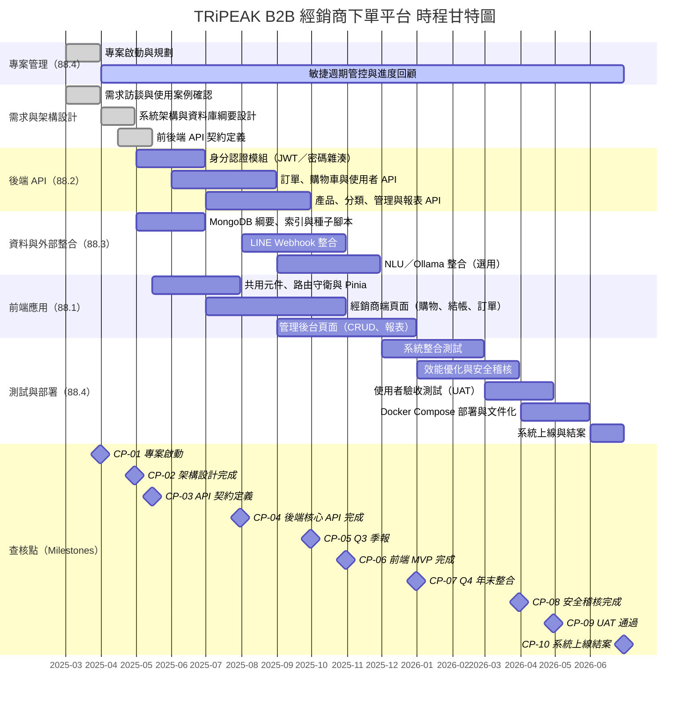

# TRiPEAK B2B 經銷商下單平台

TRiPEAK B2B 經銷商下單平台是一個專為自行車零組件經銷商設計的訂購系統，用於管理產品目錄、訂單和銷售分析。

## 功能特點

### 經銷商功能

- 瀏覽和搜索產品目錄
- 購物車和訂單管理
- 訂單狀態追蹤
- 個人帳戶管理
- 歷史訂單查詢

### 管理員功能

- 用戶管理 (新增、編輯、停用經銷商帳戶)
- 產品管理 (新增、編輯、上下架產品)
- 訂單管理 (處理訂單、更新訂單狀態)
- 分類管理
- 銷售報表和數據分析
- LINE 通知管理

## 技術架構

### 前端

- Vue 3 (Composition API)
- Vuetify 3
- Vue Router
- Pinia 狀態管理
- Axios
- Chart.js

### 後端

- Node.js + Express
- MongoDB + Mongoose
- JWT 認證
- RESTful API
- LINE Bot SDK

## 專案結構

```
tripeak-b2b/
├── backend/              # 後端 API 服務
│   ├── src/              # 源碼
│   ├── public/           # 靜態資源
│   └── ...
├── frontend/             # 前端 Vue 應用
│   ├── src/              # 源碼
│   ├── public/           # 靜態資源
│   └── ...
├── .gitignore            # Git 忽略配置
└── README.md             # 專案說明文檔
```

---

## 5.2.1 工作項目（工作分解結構 WBS）

### WBS 編碼規則


| 層級          | 說明                  | 編號範例                             |
| ----------- | ------------------- | -------------------------------- |
| 第 1 層       | 專案根節點（本專案編號 **88**） | `88`                             |
| 第 2 層       | 子系統／主要交付領域          | `88.1` … `88.4`                  |
| 第 n 層 (n≥3) | 接續上層編號後加序號          | `88.2.1`、`88.2.1.1`、`88.2.1.1.1` |


**規則摘要**：第 n 層編號以 **第 (n−1) 層完整編號** 為字首，再附加本層序號（如 `88.2` 之子項為 `88.2.1`、`88.2.2`…）。

### WBS 樹狀示意（編號與子系統對應）

```
88  TRiPEAK B2B 經銷商下單平台專案
├── 88.1  前端應用子系統（Vue 3 / Vuetify）
├── 88.2  後端 API 子系統（Express / MongoDB）
├── 88.3  資料與外部整合子系統
└── 88.4  專案管理、部署與品質保證
```

### WBS 明細表（含 DOD）

#### 88.1 前端應用子系統


| 編號     | 工作包名稱                                   | DOD（完成定義）                               |
| ------ | --------------------------------------- | --------------------------------------- |
| 88.1.1 | 經銷商端：產品瀏覽／搜尋、購物車、結帳與訂單查詢頁面              | 主要使用者流程可於本機完成；路由與 API 錯誤有基本提示；畫面與現有版型一致 |
| 88.1.2 | 管理後台：使用者、產品、訂單、分類、報表、LINE 相關頁面          | 管理員角色可完成 CRUD／狀態更新；圖表頁可載入後端資料           |
| 88.1.3 | 共用基礎：元件、路由守衛、Pinia／Redux 與 Axios API 封裝 | 登入狀態可持久化；未授權導向登入；API 基底 URL 可由環境設定      |


#### 88.2 後端 API 子系統（含第五層深度範例分支）


| 編號         | 工作包名稱                       | DOD（完成定義）                                 |
| ---------- | --------------------------- | ----------------------------------------- |
| 88.2.1     | 身分認證與授權模組                   | 模組責任範圍界定完成，且下層工作項（88.2.1.1）可驗收            |
| 88.2.1.1   | JWT 簽發、驗證與 `auth` 中介層       | 受保護路由拒絕無效 Token；有效 Token 可通過並附帶使用者識別      |
| 88.2.1.1.1 | 登入／註冊／重設密碼 API 與密碼雜湊儲存      | 單元／整合測試或手動測試清單通過；錯誤碼與訊息一致；無明文密碼入庫         |
| 88.2.2     | 訂單、購物車與使用者資料之 REST API 與控制器 | 與 Mongoose 模型一致之 CRUD；關鍵欄位驗證；與前端契約（DTO）對齊 |
| 88.2.3     | 產品、分類、管理端查詢與報表相關 API        | 分頁／篩選可用；管理與經銷商權限區隔符合設計                    |


#### 88.3 資料與外部整合子系統


| 編號     | 工作包名稱                    | DOD（完成定義）                  |
| ------ | ------------------------ | -------------------------- |
| 88.3.1 | MongoDB 綱要、索引與種子／遷移腳本    | 主要集合可啟動即建立；範例資料可重現展示情境     |
| 88.3.2 | LINE Webhook、訊息模型與通知服務串接 | 測試環境可收發／記錄事件；設定值由環境變數管理    |
| 88.3.3 | （選用）NLU／Ollama 相關服務與後端整合 | 健康檢查或 mock 可切換；失敗不影響核心下單流程 |


#### 88.4 專案管理、部署與品質保證


| 編號     | 工作包名稱                                      | DOD（完成定義）                         |
| ------ | ------------------------------------------ | --------------------------------- |
| 88.4.1 | Docker／docker-compose 與 `.env.example` 文件化 | `compose up` 可啟動前後端與資料庫；埠號與依賴說明齊備 |
| 88.4.2 | README／報告與版本提交紀律                           | 新成員可依文件建置；本次作業交付物（含 WBS）已納入版本庫或附件 |
| 88.4.3 | 整合測試與驗收清單（核心流程）                            | 註冊登入、下單、後台變更狀態等主流程可重複驗證           |


### 深度說明

### **最深路徑**：`88` → `88.2` → `88.2.1` → `88.2.1.1` → `88.2.1.1.1`（共 **五層** 編碼深度，對應身分認證由模組→JWT 中介層→登入註冊與密碼安全之細部交付）。

- **其餘分支**：`88.1`、`88.3`、`88.4` 之各工作包均至少展開至 **第三層**（`88.x.y`），並於上表定義 DOD，利於驗收與時程估計。

### 5.2.1 補充：WBS 第 2 層人力時間與成本預估

**估算目標**：對 `88.1`～`88.4`（WBS 第 2 層）進行  

1. **人力時間** 預估、2) **成本金額** 預估。  
估算流程採「先估人數與工期，再換算人力時間與成本」。

#### 估算假設

- 幣值：**新台幣（NTD）**
- 團隊組成：**共 6 人（1 位 PM + 5 位工程師）**
- 估算口徑：各 WBS 第 2 層節點均以**同一組 6 人團隊**投入估算
- 成本口徑：依你提供之 114 年外薪資水準，採**角色別月成本**估算
  - PM（計畫主持人）月成本：`125,620 + 46,241 = 171,861` 元
  - 工程師（軟體開發及程式設計師）月成本：`57,685 + 16,830 = 74,515` 元
- 團隊月成本：`1 × 171,861 + 5 × 74,515 = 544,436` 元
- 團隊年成本：`544,436 × 12 = 6,533,232` 元
- 人力時間換算：`人年 = 人數 × 年數`（或 `人年 = 人月 ÷ 12`）
- 專案規模門檻：**需大於 20 人年**

#### 估算公式

- **人力時間**：`E = P × T`
  - `E`：人力時間（人年）
  - `P`：投入人數（人）
  - `T`：工作時間（年）
- **成本金額**：`C = M × (Npm × Spm + Ndev × Sdev)`
  - `C`：成本（NTD）
  - `M`：工作月數（年數 × 12）
  - `Npm`、`Ndev`：PM 與工程師人數（本專案為 `1`、`5`）
  - `Spm`、`Sdev`：PM 與工程師月成本（`171,861`、`74,515`）

#### WBS 第 2 層預估明細（88.1～88.4）


| WBS 編號 | 節點名稱 | 預估人力 (a) | 預估工期 (b) | 人力時間 (人年) | 成本估算（NTD） |
| --- | --- | ---: | ---: | ---: | ---: |
| 88.1 | 前端應用子系統 | 1 PM + 5 工程師（共 6 人） | 1.2 年 | 7.2 | 7,839,878 |
| 88.2 | 後端 API 子系統 | 1 PM + 5 工程師（共 6 人） | 1.5 年 | 9.0 | 9,799,848 |
| 88.3 | 資料與外部整合子系統 | 1 PM + 5 工程師（共 6 人） | 0.8 年 | 4.8 | 5,226,586 |
| 88.4 | 專案管理、部署與品質保證 | 1 PM + 5 工程師（共 6 人） | 0.7 年 | 4.2 | 4,573,262 |
| 88 | 專案合計 | - | - | **25.2 人年** | **27,439,574 NTD** |


#### 規模檢核

- 本專案總人力時間：**25.2 人年**
- 與門檻比較：`25.2 > 20`，**符合「規模大於 20 人年」要求**

#### 範例換算說明

- 若某工作需 2 人、3 個月，則 `2 × 3 = 6 人月 = 0.5 人年`
- 若某工作由 `1 PM + 5 工程師` 執行 3 個月，則成本為 `3 × 544,436 = 1,633,308 NTD`

---

## 5.2.2 時程規劃

### 甘特圖（Gantt Chart）

> 專案啟動日：**2025-03-01**；預計完成日：**2026-06-30**（共約 **16 個月**）。  
> 各工作條以 WBS 編號分組，查核點（`◆`）對應 5.2.2.1 之編號。



---

### 5.2.2.1 預定查核點說明

#### 查核點設定原則

查核點依下列兩種維度交叉設定：

| 維度 | 說明 | 範例 |
| --- | --- | --- |
| **時間型** | 依固定週期設定，確保進度透明 | 季報（每季末）、月報（每月底）、里程碑節點 |
| **開發流程階段型** | 依軟體生命週期關鍵轉折設定 | 需求分析完成、架構設計、API 定義、整合、UAT、上線 |

本專案共設 **10 個查核點（CP-01 ～ CP-10）**，其中 CP-05、CP-07、CP-08 屬**時間型（季報）**，其餘屬**開發流程階段型**。

---

#### CP-01｜專案啟動查核點（階段型）

| 項目 | 內容 |
| --- | --- |
| **日期** | 2025-03-31 |
| **類型** | 開發流程階段：啟動（Initiation） |

**查核項目**

1. 專案章程（Project Charter）已核准，範疇、目標與交付物定義明確
2. 團隊角色已分配（1 PM + 5 工程師），聯絡窗口確認
3. 開發環境已建置：Node.js、Vue CLI、MongoDB、Docker、Git 倉庫
4. `.env.example` 草稿完成，必要環境變數（DB 連線、JWT Secret、LINE Token）已識別
5. WBS 第 2 層工作包（`88.1`～`88.4`）已確認，初版 Backlog 已建立

---

#### CP-02｜架構設計完成查核點（階段型）

| 項目 | 內容 |
| --- | --- |
| **日期** | 2025-04-30 |
| **類型** | 開發流程階段：設計（Architecture Design） |

**查核項目**

1. 系統架構圖（前端 Vue 3 ↔ Express API ↔ MongoDB）已定稿並版本化
2. MongoDB 集合設計（User、Product、Order、Category、LineMessage 等）已完成 ERD
3. 角色與權限矩陣（Admin / Dealer）確認，對應路由守衛策略
4. Docker Compose 初版架構（`backend`、`frontend`、`mongo`、`ollama` 服務）草稿完成
5. 技術選型決策紀錄（ADR）完成：JWT 演算法、密碼雜湊方案（bcrypt）、Vuetify 版本

---

#### CP-03｜API 契約定義查核點（階段型）

| 項目 | 內容 |
| --- | --- |
| **日期** | 2025-05-15 |
| **類型** | 開發流程階段：設計→實作交界（API Contract） |

**查核項目**

1. 所有 RESTful 端點清單（路徑、HTTP 方法、Request／Response DTO）已以文件或 Postman Collection 定義
2. 身分認證端點（`POST /auth/login`、`POST /auth/register`、`POST /auth/reset-password`）規格凍結
3. 訂單、產品、購物車、分類、報表等主要資源之端點規格凍結
4. 錯誤碼與錯誤訊息格式（統一 JSON 結構）確認
5. 前後端雙方確認契約無歧義，可分頭開發

---

#### CP-04｜後端核心 API 完成查核點（階段型）

| 項目 | 內容 |
| --- | --- |
| **日期** | 2025-07-31 |
| **類型** | 開發流程階段：實作（Backend Core Implementation） |

**查核項目**

1. JWT 簽發、驗證與 `authMiddleware` 完成：受保護路由拒絕無效 Token，有效 Token 附帶使用者識別（WBS 88.2.1.1）
2. 登入／註冊／重設密碼 API 完成，密碼以 bcrypt 雜湊儲存，無明文入庫（WBS 88.2.1.1.1）
3. 訂單、購物車、使用者資料 CRUD API 與 Mongoose 模型對齊（WBS 88.2.2）
4. Postman / Thunder Client 手動測試清單全數通過
5. MongoDB 主要集合在本機 `docker compose up` 後可自動建立，種子資料可注入

---

#### CP-05｜Q3 季報查核點（時間型）

| 項目 | 內容 |
| --- | --- |
| **日期** | 2025-09-30 |
| **類型** | 時間型：第三季季末季報（Quarterly Review） |

**查核項目**

1. 季報文件產出：各 WBS 工作包實際進度 vs. 計畫進度（燃盡圖或進度百分比）
2. 產品、分類、管理端與報表 API 開發進度確認（WBS 88.3）
3. 前端共用元件、路由守衛與 Pinia 狀態管理實作進度確認（WBS 88.1.3）
4. NLU／Ollama 健康檢查端點可呼叫，失敗不影響核心下單流程已驗證（WBS 88.3.3）
5. 風險清單更新：識別當前阻礙項（Blocker），制定 Q4 因應策略

---

#### CP-06｜前端 MVP 與 LINE 整合完成查核點（階段型）

| 項目 | 內容 |
| --- | --- |
| **日期** | 2025-10-31 |
| **類型** | 開發流程階段：整合（Frontend MVP & External Integration） |

**查核項目**

1. 經銷商端主要使用者流程可於本機完成：登入 → 瀏覽產品 → 加入購物車 → 結帳 → 查詢訂單（WBS 88.1.1）
2. 管理後台可完成 CRUD 與訂單狀態更新；圖表頁可載入後端報表資料（WBS 88.1.2）
3. LINE Webhook 在測試環境可收發並記錄事件；Bot Token 由環境變數管理（WBS 88.3.2）
4. 前後端整合冒煙測試（Smoke Test）通過：無 CORS 錯誤、API 回應格式與前端預期一致
5. 路由守衛驗證：未登入使用者導向登入頁，Admin 路由拒絕 Dealer 角色

---

#### CP-07｜Q4 年末整合查核點（時間型）

| 項目 | 內容 |
| --- | --- |
| **日期** | 2025-12-31 |
| **類型** | 時間型：第四季年末季報 + 里程碑（Year-End Review） |

**查核項目**

1. 年末季報產出：累計實際成本 vs. 預算（依 5.2.1 各工作包追蹤）
2. 系統整合測試（Integration Test）啟動：所有主要 API 路徑於 Docker Compose 環境下通過
3. 管理後台頁面（CRUD、報表）開發完成，版本合併至 `main`（WBS 88.1.2）
4. 已知技術債清單建立，並排入 Q1 2026 Sprint Backlog
5. `docker compose up` 可完整啟動前後端、MongoDB 及 Ollama 服務，埠號無衝突（WBS 88.4.1）

---

#### CP-08｜安全稽核與效能優化完成查核點（時間型 + 階段型）

| 項目 | 內容 |
| --- | --- |
| **日期** | 2026-03-31 |
| **類型** | 時間型：第一季季報 + 開發流程階段：安全／效能（Security Audit） |

**查核項目**

1. Q1 季報產出：整合測試覆蓋率、缺陷密度與修復進度
2. OWASP Top 10 自評清單完成：SQL Injection（NoSQL Injection）、XSS、未授權存取等主要風險確認已緩解
3. JWT Secret、LINE Token、DB 連線字串等敏感資訊確認不存在版本庫，全部以環境變數注入
4. API 回應效能基準測試：主要端點（產品列表、訂單查詢）P95 回應時間 < 500ms
5. MongoDB 索引複審：高頻查詢欄位（productId、orderId、userId、createdAt）已建立索引

---

#### CP-09｜使用者驗收測試（UAT）完成查核點（階段型）

| 項目 | 內容 |
| --- | --- |
| **日期** | 2026-04-30 |
| **類型** | 開發流程階段：驗收（User Acceptance Testing） |

**查核項目**

1. UAT 測試腳本（含 WBS 88.4.3 驗收清單）由利害關係人或代理測試者執行完畢
2. 核心流程通過驗收：註冊登入 → 下單 → 管理後台變更訂單狀態 → 收到 LINE 通知
3. 所有 P0（阻塞性）與 P1（高嚴重度）缺陷已修復並複驗通過
4. 使用者介面一致性確認：版型、字型、色彩與 Vuetify 設計規範對齊（WBS 88.1.1 DOD）
5. 上線前確認清單（Go-Live Checklist）草稿完成，待 CP-10 前簽核

---

#### CP-10｜系統上線與專案結案查核點（里程碑型）

| 項目 | 內容 |
| --- | --- |
| **日期** | 2026-06-30 |
| **類型** | 里程碑：系統正式上線（Go-Live & Project Closure） |

**查核項目**

1. 系統正式部署至生產環境，`docker compose up` 或等效部署方式驗證通過
2. `.env.example` 與 README 建置步驟完整，新成員可依文件於 30 分鐘內完成本機建置（WBS 88.4.2 DOD）
3. 最終版本已提交至版本庫，Tag 標記（`v1.0.0`）並附 Release Notes
4. 專案結案報告產出：包含實際 vs. 計畫人力時間、成本差異、風險回顧與後續維運建議
5. 所有 WBS 工作包之 DOD 完成清單已核簽，專案正式關閉

---

#### 查核點總覽表

| 編號 | 日期 | 類型 | 查核點名稱 | 主要 WBS 對應 |
| --- | --- | --- | --- | --- |
| CP-01 | 2025-03-31 | 階段型（啟動） | 專案啟動與環境建置確認 | 88.4 |
| CP-02 | 2025-04-30 | 階段型（設計） | 系統架構與資料庫設計完成 | 88.2、88.3 |
| CP-03 | 2025-05-15 | 階段型（API 契約） | 前後端 API 契約定義凍結 | 88.2、88.1 |
| CP-04 | 2025-07-31 | 階段型（實作） | 後端核心 API 完成 | 88.2.1、88.2.2 |
| CP-05 | 2025-09-30 | **時間型（Q3 季報）** | 第三季進度季報與風險更新 | 全部 |
| CP-06 | 2025-10-31 | 階段型（整合） | 前端 MVP 與 LINE 整合完成 | 88.1、88.3.2 |
| CP-07 | 2025-12-31 | **時間型（Q4 年末）** | 年末季報與整合測試啟動 | 全部 |
| CP-08 | 2026-03-31 | **時間型（Q1 季報）** + 階段型 | 安全稽核與效能優化完成 | 88.2、88.4 |
| CP-09 | 2026-04-30 | 階段型（UAT） | 使用者驗收測試通過 | 88.4.3 |
| CP-10 | 2026-06-30 | 里程碑（上線） | 系統正式上線與專案結案 | 88.4.1、88.4.2 |

---

## 6. 流程模式

**作業對應**：第三章（流程／生命週期相關）— 說明本專案在軟體生命週期中如何安排需求、設計、實作、測試與交付之節奏，並於 **6.1.1** 具體選定 **開發模式** 與其適用理由。

### 6.1 流程模式

軟體專案的「流程模式」可從兩個層次理解：**生命週期模型**（例如瀑布、螺旋、迭代增量）決定整體階段劃分與風險控管方式；**開發模式／方法**（例如敏捷、RUP、看板）則決定團隊如何排程、溝通與交付可執行軟體。TRiPEAK B2B 平台同時具備 **雙端應用（Vue 前端 + Express 後端）**、**MongoDB 資料模型**、**JWT 安全機制** 與 **LINE／選用 NLU 等外部整合**，需求易隨營運或法規微調，故不適合將全部規格凍結後才一次性實作的純瀑布流程；本專案採 **以迭代增量為骨架、以敏捷實務為節奏** 的流程取向，並於下一小節固定開發模式名稱與內涵。

### 6.1.1 開發模式

#### 選定模式

**敏捷開發（Agile Development）**，並以 **簡化版 Scrum**（固定長度之迭代／Sprint、每迭代產出可示範之增量）作為主要運作方式；必要時對單一課題（例如 LINE Webhook 除錯）輔以 **看板（Kanban）式** 的可視化待辦，但不改變「短週期交付可驗收軟體」之核心。

#### 挑選理由（與本專案屬性對齊）

| 專案屬性                               | 為何適合敏捷／迭代                                     |
| ---------------------------------- | --------------------------------------------- |
| 功能面多（經銷商購物流、管理後台、報表、通知、B2B腳踏車零件配單） | 可優先交付 **最小可行產品（MVP）** 再依回饋擴充，降低一次規劃過大而落後市場的風險 |
| 前後端分離、介面契約（REST）需反覆對齊              | 短迭代內完成「可整合」之垂直切片，利於及早發現 API 與畫面不一致            |
| 外部依賴（LINE、選用 Ollama）               | 環境與第三方行為變動多，**頻繁整合與驗證** 比長期設計文件更能控制風險         |
| 與 WBS／DOD 搭配                       | 每個工作包可在 Sprint 內對應 **可驗收條件**，與敏捷「完成定義」一致      |


相對地，**純瀑布模型** 假設前期需求可高度凍結且變更成本高；對本專案這類 Web 系統與外部整合並存之情境，若堅持長階段才整合，易在後期才暴露介面與部署問題，修正成本較高。故選擇強調 **早期交付、持續整合** 的敏捷迭代思維。

#### 模式特性

1. **迭代（Iteration）**：以 1～3 週等固定長度為一個 Sprint，重複「規劃 → 開發 → 測試 → 檢視」循環。
2. **增量（Incremental）**：每一迭代結束應增加「使用者可感知」之功能或修正，而非僅產出文件。
3. **跨職能協作**：前端、後端、資料綱要與 DevOps（Docker）可在同一迭代內對齊交付物。
4. **可調整待辦清單（Product Backlog）**：優先級可依營運或作業截止日調整，符合在職專班與業務並行之現實。
5. **自省（Retrospective）**：每迭代簡短回顧流程與工具（例如測試、文件、分支策略），持續改善。

#### 優點

- **風險前移**：整合與部署問題及早浮現，避免期末才「大爆炸式」接線。  
- **價值較早可見**：利害關係人可在每個 Sprint 末看到可操作版本，利於確認方向。  
- **變更成本較可控**：以 Backlog 重排因應需求微調，勝過大規格書鎖死後再變更。  
- **與現代工具鏈契合**：Git 分支、CI、Docker Compose、環境變數管理等皆適合短週期釋出。  
- **品質意識內建**：若將 **DOD** 與 **測試／Code Review** 納入迭代完成條件，可避免「只求功能列表勾選」而忽略安全與可維運性。

#### 實務上需注意之處（簡要）

敏捷並非「沒有文件」，而是 **剛好夠用、靠近程式碼與可執行成果** 的文件（例如 API 範例、`.env.example`、README 建置步驟）。在學期或專題時程下，仍應保留 **架構決策摘要** 與 **驗收清單**，以滿足課程與日後維運之可追溯性。

---

© 2025 Paul Lee. 版權所有。 